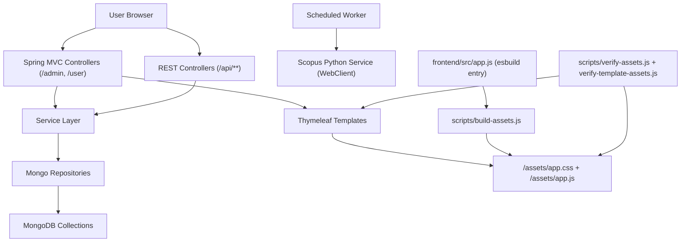

# H02-S01 Architecture Map (Current State)

Date: 2026-03-03  
Scope: runtime architecture and dependency directions across backend, templates, frontend assets, and scripts.

## 1. Runtime Topology

## 2. Major Runtime Entry Points

### 2.1 Web MVC (HTML)

- `AdminViewController` (`/admin`) is the largest admin web entrypoint and directly orchestrates user/researcher/scopus/ranking/reporting CRUD and exports.
- `UserViewController` (`/user`) is the largest user-facing entrypoint and directly orchestrates publication/citation views, indicator application, task creation, and CNFIS export.
- Additional focused MVC controllers exist for activity instances, publication wizard, groups, reports, activities, and URAP pages.

Representative files:
- `src/main/java/ro/uvt/pokedex/core/view/AdminViewController.java`
- `src/main/java/ro/uvt/pokedex/core/view/UserViewController.java`
- `src/main/java/ro/uvt/pokedex/core/view/AdminGroupController.java`
- `src/main/java/ro/uvt/pokedex/core/view/user/ActivityInstanceController.java`
- `src/main/java/ro/uvt/pokedex/core/view/user/PublicationWizardController.java`

### 2.2 REST/API

- `/api/admin/users` and `/api/admin/researchers` expose CRUD-like admin APIs.
- `/api/scrape/**` exists as a scraping trigger façade (currently with commented execution calls).
- `/api/export` streams Excel forum exports.

Representative files:
- `src/main/java/ro/uvt/pokedex/core/controller/UserController.java`
- `src/main/java/ro/uvt/pokedex/core/controller/AdminResearcherController.java`
- `src/main/java/ro/uvt/pokedex/core/controller/WebScrapingController.java`
- `src/main/java/ro/uvt/pokedex/core/controller/ExportController.java`

### 2.3 Background/Async Runtime

- `ScopusUpdateScheduler` polls task queues (`@Scheduled`) and drives import/update execution through `ScopusDataService` and repositories.
- Multiple import services run async (`@Async("taskExecutor")`) for rankings/scopus/cncsis/core/sense ingest.

Representative files:
- `src/main/java/ro/uvt/pokedex/core/service/scopus/ScopusUpdateScheduler.java`
- `src/main/java/ro/uvt/pokedex/core/service/importing/ScopusDataService.java`
- `src/main/java/ro/uvt/pokedex/core/service/importing/RankingService.java`
- `src/main/java/ro/uvt/pokedex/core/config/AsyncConfiguration.java`

## 3. Current Layer/Module Inventory

| Area | Primary Packages/Files | Runtime Responsibility | Outgoing Dependencies |
|---|---|---|---|
| App bootstrap/config | `core/CoreApplication`, `core/config/*` | startup, security rules, async executor, HTTP clients | service layer, Spring infra |
| Web MVC views | `core/view/**` | HTML endpoints, model assembly, redirects, exports | repositories + reporting/importing/core services + templates |
| REST API | `core/controller/**` | API endpoints for admin CRUD, scraping trigger, export | services + repositories |
| Reporting/scoring | `core/service/reporting/**` | indicator/activity/publication scoring, CNFIS export path | cache + repositories + scoring sub-services |
| Importing | `core/service/importing/**` | bulk ingestion from files/external sources | cache + repositories |
| Scopus task processing | `core/service/scopus/**` | scheduled queue polling and update execution | repositories + `ScopusDataService` + WebClient |
| Core/domain services | `core/service/*.java` | user/auth/researcher/cache/scopus abstraction | repositories + RestTemplate/WebClient |
| Persistence | `core/repository/**` | MongoDB repository access | `core/model/**` documents |
| Templates | `src/main/resources/templates/**` | thymeleaf rendering for admin/user/errors/publications | static assets + controller-provided model |
| Frontend build/runtime assets | `frontend/src/app.js`, `scripts/*.js` | JS/CSS bundling and template asset contract verification | `src/main/resources/static/assets/**` + templates |

## 4. Dependency Direction (As Implemented)

Expected direction currently observed in runtime code:

1. Browser -> Controllers (`view`/`controller`).
2. Controllers -> Services and frequently Controllers -> Repositories directly.
3. Services -> Repositories (plus cache/external clients).
4. Repositories -> MongoDB document collections.
5. Controllers -> Thymeleaf templates -> static assets (`/assets/app.css`, `/assets/app.js`).
6. Scheduler/async services -> repositories/services -> external Scopus python API via `WebClient`.

## 5. Major Runtime Flows

| Flow | Entry | Orchestration Core | Data Access | Output |
|---|---|---|---|---|
| Admin CRUD + listings | `/admin/**` | `AdminViewController` (+ specialized admin controllers) | many repositories directly | thymeleaf admin pages |
| User publications/citations/reporting | `/user/**` | `UserViewController` (+ user subcontrollers) | scopus/reporting/task repositories + reporting services | thymeleaf user pages + downloads |
| Group reporting/export | `/admin/groups/**` | `AdminGroupController` | group/researcher/scopus/reporting repositories + scoring services | group pages + archive/report exports |
| Scoring execution | indicator apply/report routes | `ScientificProductionService`, `ActivityReportingService`, `ScoringFactoryService` | rankings/core/sense/cncsis/cache + scopus forum/publication data | per-item and total scores |
| CNFIS 2025 export | `/user/exports/cnfis`, `/admin/groups/{id}/publications/exportCNFIS2025` | `CNFISScoringService2025` + `CNFISReportExportService` | scopus data + ranking/cache sources | CNFIS export file |
| Scopus publication update | scheduled poll | `ScopusUpdateScheduler` + `ScopusDataService` | task repos + scopus repos | updated publications/tasks statuses |
| Scopus citation update | scheduled poll | `ScopusUpdateScheduler` + `ScopusDataService` | citation/pub/task repos | updated citation graph/tasks statuses |
| Frontend asset contract | npm scripts | `build-assets.js`, `verify-assets.js`, `verify-template-assets.js` | static assets + template files | build artifacts + CI/workflow gate |

## 6. Template and Frontend Contract Map

- Common fragments are centralized in `src/main/resources/templates/fragments.html` (navbar + sidebars).
- Runtime templates under `templates/admin/**` and `templates/user/**` are expected to reference:
  - `/assets/app.css`
  - `/assets/app.js`
- `scripts/verify-template-assets.js` enforces:
  - no `/vendor/` references
  - mandatory `/assets/app.css` and `/assets/app.js`
  - hard-fail on forbidden `*-bak.html` in runtime template directories
- `frontend/src/app.js` is the single bundle entrypoint; `scripts/build-assets.js` emits `app.css` and `app.js` into static assets.

## 7. Boundary Notes (Current-State Observations)

These are observations for H02-S02/H02-S03 design, not remediation decisions yet.

- MVC controllers are not thin: large controllers hold orchestration/business logic and direct repository access.
- Reporting/scoring has a factory-based strategy split, but controllers often bypass service facades and compose repositories directly.
- Cache and ranking concerns are cross-cutting and reused by importing + reporting.
- Asset/template contract now has script-level enforcement, reducing frontend drift risk.

## 8. H02-S01 Exit Check

- Major runtime web path mapped: web -> controller/view -> service/repository -> templates/assets.
- Major background path mapped: scheduler -> services -> repos/external API.
- Template and frontend script flow mapped with verification gates.
- Dependency directions documented for use in H02-S02 boundary definition.
