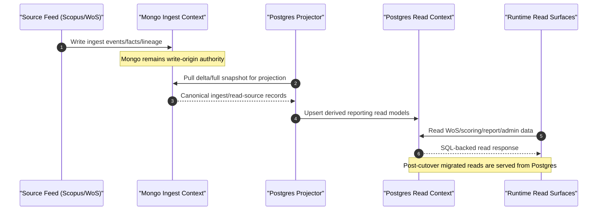
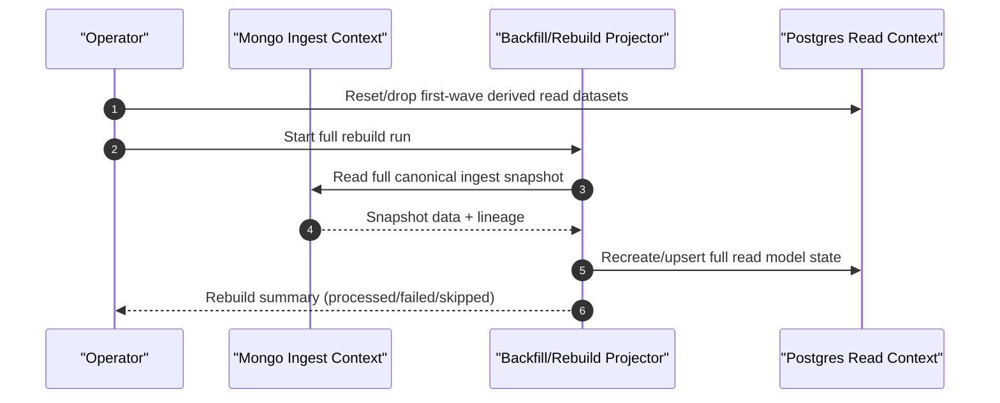
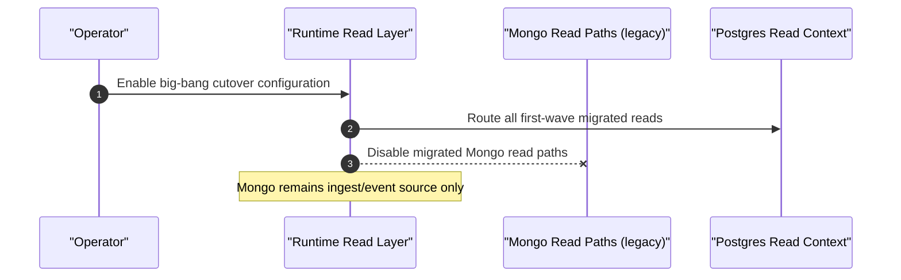
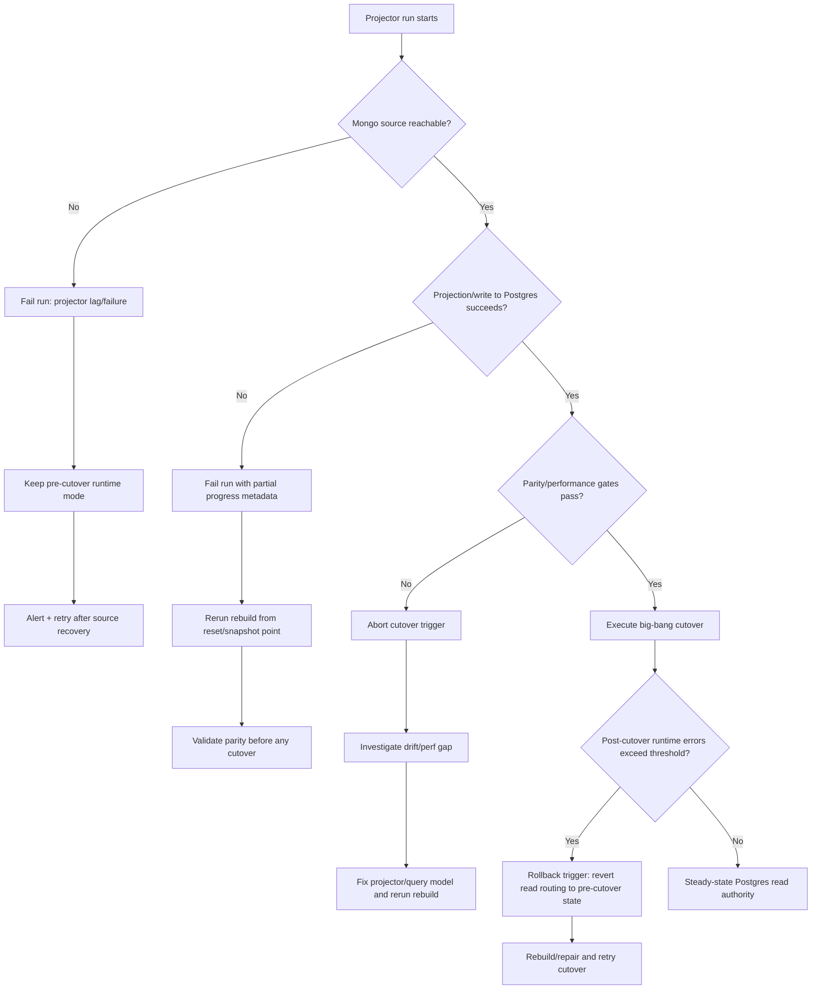

# H22.1 Postgres Reporting Sequences

Date: 2026-03-11  
Status: companion sequence baseline for `docs/tasks/closed/h22.1-postgres-reporting-architecture-contract.md`.

## 1. Ingest Write -> Projector Sync -> Steady-State Read

## 2. Reset-First Backfill/Rebuild (Big-Bang Preparation)

## 3. Big-Bang Read Cutover

## 4. Failure Branches and Recovery Triggers

## 5. Trigger Semantics (Locked for H22.1)

- Projector lag/failure:
  - does not change Mongo write-origin ownership.
  - blocks cutover until rebuild/parity checks pass.
- Rebuild rerun:
  - allowed and expected under reset-first strategy.
  - must converge to equivalent derived read state for the same source snapshot.
- Cutover abort/rollback:
  - cutover is canceled if parity/performance gates fail.
  - if post-cutover error budget breaches, runtime read routing must be reverted to pre-cutover mode while issues are fixed.

